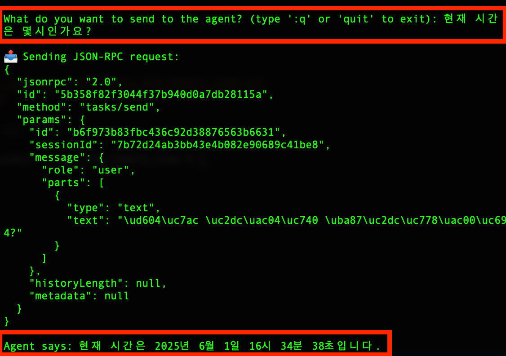
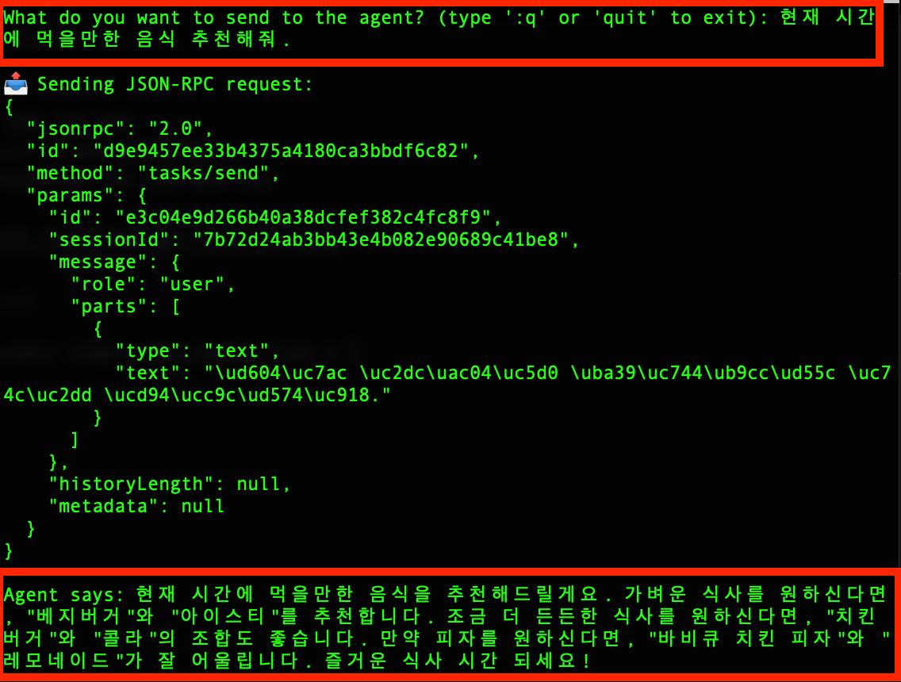

# Simple A2A (Agent to Agent) Sample Code

> **Reference:** [A2A Sample Code on GitHub](https://github.com/theailanguage/a2a_samples)

This project is a sample implementation demonstrating a multi-agent system using the **A2A (Agent-to-Agent) protocol**, where multiple agents communicate and collaborate seamlessly.

---

## 🧑‍💻 Agent Components

1. **TellTimeAgent** – Agent that provides the current time  
2. **RestaurantMenuAgent** – Agent that provides restaurant menu information  
3. **WriteAgent** – Agent that composes text content  
4. **HostAgent (Orchestrator)** – Orchestrator that routes requests to the appropriate agents  

> Each agent operates in coordination through **A2A Discovery** and **JSON-RPC communication**.

---

## 📸 A2A Operation Examples

### 🔹 Example 1: Request Current Time

- **User Query**  
  👉 “What time is it now?”

- **Workflow**  
  1. ⏱️ `TellTimeAgent` retrieves the current time  
  2. 🧠 `Orchestrator` receives the response and delivers it to the user  



---

### 🔹 Example 2: Food Recommendation Based on Current Time

- **User Query**  
  👉 “Please recommend something to eat right now.”

- **Workflow**  
  1. ⏱️ `TellTimeAgent` retrieves the current time  
  2. 🍽️ `RestaurantMenuAgent` provides menu information  
  3. 🧠 `Orchestrator` combines the information to recommend food  



---

## 🚀 Installation & Running (MacOS)

### 1. Clone the repository
```bash
git clone https://github.com/Leon-real/Simple_A2A_Sample_Code.git
cd Simple_A2A_Sample_Code
```
### 2. Create and activate a virtual environment
```bash
python3 -m venv .venv
source .venv/bin/activate
```

### 3. Install required libraries
- If using `uv`:
```bash
uv pip sync requirements.txt
```
- If using `pip`:
```bash
pip install -r requirements.txt
```
### 4. Set up LLM API keys
Create a `.env` file in the project root and add
```bash
# For Gemini
GOOGLE_API_KEY=

# For OpenAI
OPENAI_API_KEY=

# For Local Ollama (localhost:11434)
OLLAMA_API_BASE=http://localhost:11434
```

### 5. Run agent servers

#### Run TellTimeAgent
```bash
python3 -m agents.tell_time_agent --host localhost --port 10000 2>&1 | python3 decode_log.py
```
#### Run RestaurantMenuAgent 
```bash
python3 -m agents.RestaurantMenu_agent --host localhost --port 10001 2>&1 | python3 decode_log.py
```
#### Run WriteAgent  
- (Requires Python 3.10, recommended to run in separate virtual environment)
```bash
python -m agents.write_agent --host localhost --port 10003 2>&1 | python3 decode_log.py
```
#### Run HostAgent(Orchestrator) 
```bash
python3 -m agents.host_agent.entry --host localhost --port 10002 2>&1 | python3 decode_log.py
```
### 6. CLI Test
```bash
python3 -m app.cmd.cmd --agent http://localhost:10002
```
---
## 📦 Project Structure
```bash
.
.
├── README.md                    # Project overview and instructions

├── agents                       # Source code for various agents
│   ├── RestaurantMenu_agent     # Agent providing restaurant menu info
│   │   ├── __main__.py          # Agent entry point
│   │   ├── agent.py             # Core logic for agent
│   │   └── task_manager.py      # Task scheduling and management
│   ├── host_agent               # Host agent handling orchestration
│   │   ├── agent_connect.py     # Communication between agents
│   │   ├── entry.py             # Program entry and initialization
│   │   └── orchestrator.py      # Task orchestrator
│   ├── tell_time_agent          # Agent providing current time
│   │   ├── __main__.py          # Agent entry point
│   │   ├── agent.py             # Time retrieval and response logic
│   │   └── task_manager.py      # Time-related task management
│   └── write_agent              # Agent for text generation and writing
│       ├── __main__.py          # Agent entry point
│       ├── agent.py             # Core writing logic
│       └── task_manager.py      # Writing task scheduling

├── app                          # CLI command-related code for testing
│   └── cmd
│       ├── __init__.py          # cmd module initialization
│       └── cmd.py               # Command execution and handling logic

├── client                       # Client-side code
│   └── client.py                # Client core communicating with servers

├── models                       # Data models and agent abstractions
│   ├── __init__.py              # models package initialization
│   ├── agent.py                 # Agent abstract model definition
│   ├── json_rpc.py              # JSON-RPC communication implementation
│   ├── request.py               # Request data models
│   └── task.py                  # Task data models

├── server                       # Server-side code
│   ├── __init__.py              # server package initialization
│   ├── server.py                # Server runtime and request handling
│   └── task_manager.py          # Server-side task management and scheduling

├── utilities                    # Utility and helper scripts
│   ├── agent_registry.json      # Agent registry information in JSON
│   └── discovery.py             # Network or agent discovery scripts

# ──────────────────────────────────────────────
# Single files in the root directory
# ──────────────────────────────────────────────
├── decode_log.py               # Log decoding and analysis (Korean decoding)
└── requirements.txt            # Python package dependencies

```


---

## How It Works

1. **Discovery**: The OrchestratorAgent reads `utilities/agent_registry.json` and fetches each agent’s `/.well-known/agent.json` for info gathering.

2. **Routing**: Based on the user’s intent, the orchestrator LLM calls the appropriate tool:
    - `list_agents()` → Returns a list of registered agents
    - `delegate_task(agent_name, message)` → Delegates task to a specific agent

3. **Child Agents**:
    - **TellTimeAgent**: Returns current time
    - **RestaurantMenuAgent**: Provides menu information
    - **WriteAgent**: Generates text content

4. **JSON-RPC**: All communications use JSON-RPC 2.0 over HTTP with Starlette & Uvicorn.

---

## 📚 References

- [A2A Official GitHub](https://github.com/google/A2A)
- [Google Agent Development Kit (ADK)](https://github.com/google/agent-development-kit)
- [A2A Sample Code Reference GitHub](https://github.com/theailanguage/a2a_samples)
---

> **Contact / Feedback**: tutmr999@naver.com
