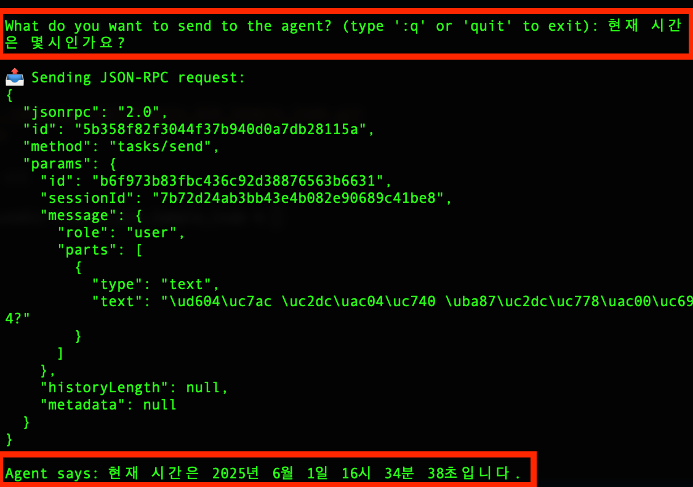
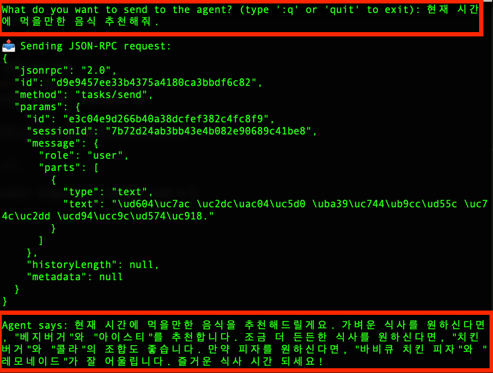

# Simple A2A (Agent to Agent) Sample Code

> **참고:** [A2A 샘플 코드 참고 깃허브](https://github.com/theailanguage/a2a_samples)

이 프로젝트는 **A2A(Agent-to-Agent) 프로토콜**을 활용하여, 여러 에이전트가 서로 통신하고 협업하는 구조를 구현한 샘플 코드입니다.

---

## 🧑‍💻 에이전트 구성

1. **TellTimeAgent** – 현재 시간을 알려주는 에이전트  
2. **RestaurantMenuAgent** – 식당 메뉴 정보를 제공하는 에이전트  
3. **WriteAgent** – 글을 작성해주는 에이전트  
4. **HostAgent (Orchestrator)** – 요청을 적절한 에이전트로 라우팅하는 오케스트레이터  

> 각 에이전트는 **A2A Discovery**와 **JSON-RPC 통신**을 통해 유기적으로 연결되어 작동합니다.

---

## 📸 A2A 작동 결과

### 🔹 사용 예시 1: 현재 시간 요청

- **User Query**  
  👉 “현재 시간은 몇시인가요?”

- **동작 흐름**  
  1. ⏱️ `TellTimeAgent`가 현재 시간 조회  
  2. 🧠 `Orchestrator`가 응답을 받아 사용자에게 전달  



---

### 🔹 사용 예시 2: 현재 시간에 맞는 음식 추천

- **User Query**  
  👉 “현재 시간에 먹을만한 음식 추천해줘.”

- **동작 흐름**  
  1. ⏱️ `TellTimeAgent`가 현재 시간 조회  
  2. 🍽️ `RestaurantMenuAgent`가 메뉴 정보 제공  
  3. 🧠 `Orchestrator`가 받은 정보를 기반으로 음식 추천  



---

## 🚀 설치 및 실행 (MacOS 기준)

### 1. 레포지토리 클론
```bash
git clone https://github.com/Leon-real/Simple_A2A_Sample_Code.git
cd Simple_A2A_Sample_Code
```
### 2. 가상환경 생성 및 활성화
```bash
python3 -m venv .venv
source .venv/bin/activate
```

### 3. 필요한 라이브러리 설치
- `uv` 사용 시:
```bash
uv pip sync requirements.txt
```
- `pip` 사용 시:
```bash
pip install -r requirements.txt
```
### 4. LLM API Key 설정
프로젝트 루트에 `.env` 파일을 생성하고 아래와 같이 입력하세요.
```bash
# For Gemini
GOOGLE_API_KEY=

# For OpenAI
OPENAI_API_KEY=

# For Local Ollama (localhost:11434)
OLLAMA_API_BASE=http://localhost:11434
```

### 5. 에이전트 서버 실행

#### TellTimeAgent 실행
```bash
python3 -m agents.tell_time_agent --host localhost --port 10000 2>&1 | python3 decode_log.py
```
#### RestaurantMenuAgent 실행
```bash
python3 -m agents.RestaurantMenu_agent --host localhost --port 10001 2>&1 | python3 decode_log.py
```
#### WriteAgent 실행  
- (파이썬 3.10 환경 필요, 별도 가상환경 권장)
```bash
python -m agents.write_agent --host localhost --port 10003 2>&1 | python3 decode_log.py
```
#### HostAgent(Orchestrator) 실행
```bash
python3 -m agents.host_agent.entry --host localhost --port 10002 2>&1 | python3 decode_log.py
```
### 6. CLI 테스트
```bash
python3 -m app.cmd.cmd --agent http://localhost:10002
```
---
## 📦 프로젝트 구조
```bash
.
├── README.md                    # 프로젝트 기본 설명서

├── agents                       # 여러 에이전트(봇) 소스코드 모음
│   ├── RestaurantMenu_agent     # 식당 메뉴 관련 에이전트
│   │   ├── __main__.py          # 에이전트 실행 진입점
│   │   ├── agent.py             # 에이전트 핵심 로직
│   │   └── task_manager.py      # 작업 관리 및 스케줄링 담당
│   ├── host_agent               # 호스트 에이전트 (에이전트 연결 및 조율)
│   │   ├── agent_connect.py     # 에이전트 간 통신 연결 담당
│   │   ├── entry.py             # 프로그램 진입점 및 초기화
│   │   └── orchestrator.py      # 에이전트 작업 조율자 역할
│   ├── tell_time_agent          # 현재 시간 알려주는 에이전트
│   │   ├── __main__.py          # 에이전트 실행 진입점
│   │   ├── agent.py             # 시간 조회 및 응답 로직
│   │   └── task_manager.py      # 시간 관련 작업 관리
│   └── write_agent              # 텍스트 생성 및 작성 에이전트
│       ├── __main__.py          # 에이전트 실행 진입점
│       ├── agent.py             # 글 작성 핵심 로직
│       └── task_manager.py      # 작성 작업 스케줄링 담당

├── app                          # 애플리케이션 커맨드 관련 코드(CLI 환경 테스트를 위해)
│   └── cmd
│       ├── __init__.py          # cmd 모듈 초기화 파일
│       └── cmd.py               # 커맨드 실행 및 처리 로직

├── client                       # 클라이언트 측 코드
│   └── client.py                # 서버와 통신하는 클라이언트 핵심 코드

├── models                       # 데이터 모델 및 에이전트 추상화 관련
│   ├── __init__.py              # models 패키지 초기화
│   ├── agent.py                 # 에이전트 추상 모델 정의
│   ├── json_rpc.py              # JSON-RPC 통신 구현
│   ├── request.py               # 요청 데이터 모델
│   └── task.py                  # 작업(Task) 데이터 모델

├── server                       # 서버 측 코드
│   ├── __init__.py              # server 패키지 초기화
│   ├── server.py                # 서버 실행 및 요청 처리
│   └── task_manager.py          # 서버 내 작업 관리 및 스케줄링

├── utilities                    # 유틸리티 및 도우미 스크립트
│   ├── agent_registry.json      # 에이전트 등록 정보 JSON
│   └── discovery.py             # 네트워크 또는 에이전트 탐색 관련 스크립트

# ──────────────────────────────────────────────
# 단일 파일 모음 (루트 디렉터리에 위치)
# ──────────────────────────────────────────────
├── decode_log.py               # 로그 디코딩 및 분석용 스크립트(한국어 디코딩용)
└── requirements.txt            # 파이썬 패키지 의존성 목록

```


---

## 🔍 작동 방식 (How It Works)

1. **Discovery**: OrchestratorAgent가 `utilities/agent_registry.json`을 읽고, 각 에이전트의 `/​.well-known/agent.json`을 조회하여 정보를 수집합니다.
2. **Routing**: 사용자의 요청 의도(intent)에 따라 Orchestrator LLM이 적절한 툴을 호출합니다.
    - `list_agents()` → 등록된 에이전트 목록 반환
    - `delegate_task(agent_name, message)` → 특정 에이전트에 작업 위임
3. **Child Agents**:
    - TellTimeAgent: 현재 시간 반환
    - RestaurantMenuAgent: 메뉴 정보 제공
    - WriteAgent: 글 작성
4. **JSON-RPC**: 모든 통신은 Starlette & Uvicorn 기반 HTTP 위에서 JSON-RPC 2.0 프로토콜로 이루어집니다.

---

## 📚 참고 자료

- [A2A 공식 GitHub](https://github.com/google/A2A)
- [Google Agent Development Kit (ADK)](https://github.com/google/agent-development-kit)
- [A2A 샘플 코드 참고 깃허브](https://github.com/theailanguage/a2a_samples)
---

> **문의/피드백**: tutmr999@naver.com